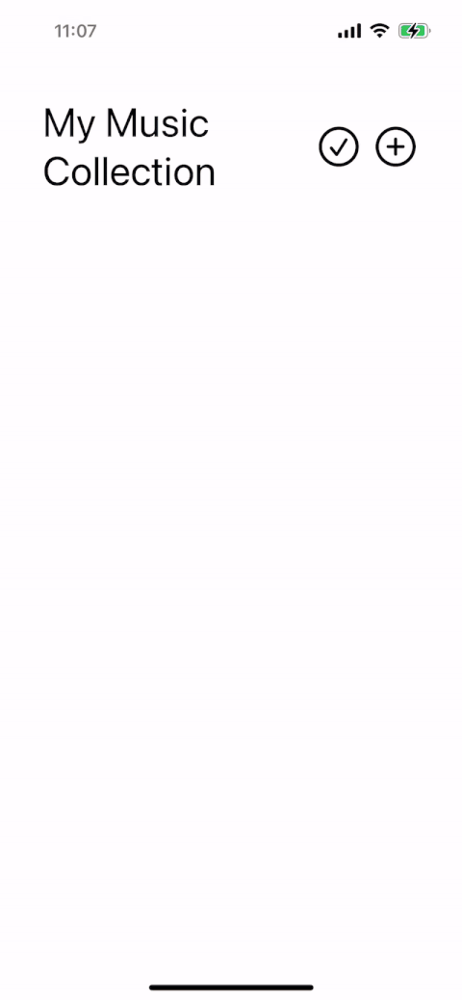
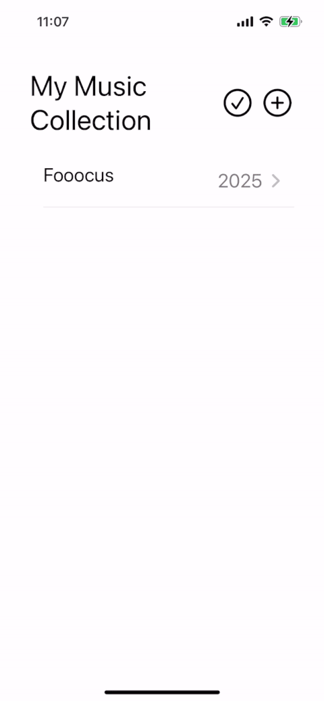
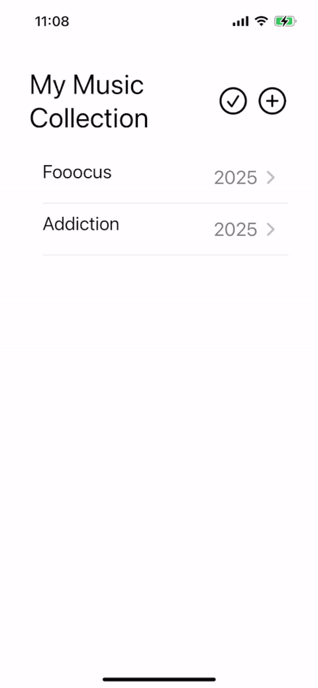

# ReCoShelf

A simple iOS app to track and manage your physical music collection.

# Tech Stack

- Swift
- SwiftUI
- SwiftData

# Features

- Scan the barcode of physical releases by device camera to search release detail, then you can add the release into your collection.



- View & Manage your music collection.





# Data Flow / Sync Strategy

- Uses SwiftData as the local store and the UI renders data from SwiftData.
- For network-backed actions (add/remove), it currently follows a server-first flow: call backend APIs first, then update SwiftData on success to keep local state consistent with the server.
  - It can be extended to a local-first sync model in future iterations.

# Installation

## Requirements
- macOS with Xcode 15+
- iOS 17+ simulator or device
- Discogs API key/secret
  - Need to create an app from: [Discogs](https://www.discogs.com/developers/#)
- [recoshelf-api](https://github.com/JJJamieee/recoshelf-api) running locally (for add/remove sync)

## Setup
```
cp Config.example.xcconfig Config.xcconfig
```
Edit `Config.xcconfig` and set your Discogs API values.
Set `RECOSHELF_API_URL` to your local backend base URL (for example, `http://127.0.0.1:3000`).

## Run
1. Open `ReCoShelf.xcodeproj` in Xcode.
2. Select a simulator or device.
3. Build and run.
